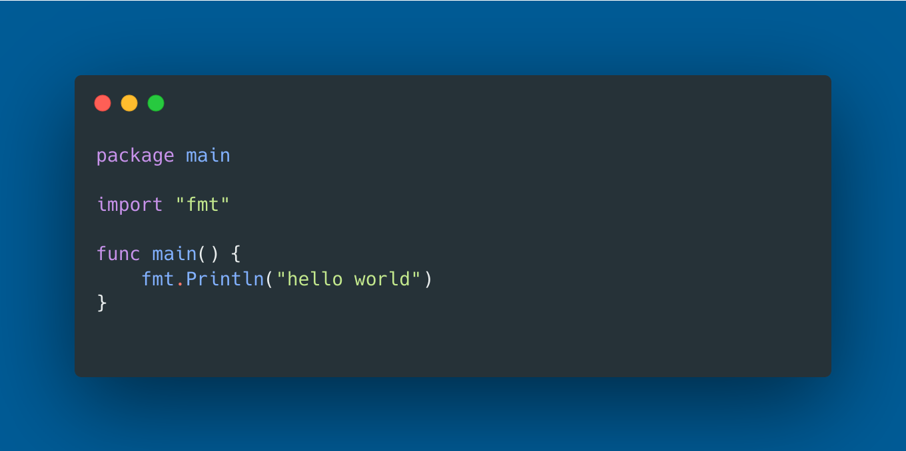
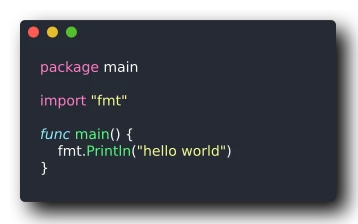
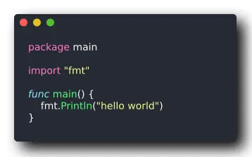

<!--more-->


<!--- caption --->
<!-- Photo generated by the author on Midjourney -->

Generate images from code snippets and terminal output with [Freeze](https://github.com/charmbracelet/freeze) as a programmatic alternative to [Carbon](https://carbon.now.sh/).

## Introduction
If you, like me, enjoy sharing code snippets as images on Twitter/X, you might have used a tool called Carbon to generate images from source code or terminal output in the past.

Here it is an example of using Carbon to render a simple Hello World in Golang.

<figure>
  
  <figcaption>Image generated with Carbon</figcaption>
</figure>

Carbon is an excellent tool because it allows you to customize the image with different colours, fonts, language settings, and more.

My only problem with Carbon is that it doesn't provide an API or a command-line tool for running it locally. 

If you use Carbon as often as I do, you might want to automate the process and look for a CLI tool instead.

That's how I found [Freeze](https://github.com/charmbracelet/freeze) from the company [Charm](https://charm.sh/), a small binary CLI tool that can "almost" replace Carbon.

I say almost because Freeze still has some rough edges to smooth. More on this later.

I'm a massive fan of anything from Charm. Since I discovered [Gum](https://github.com/charmbracelet/gum), a CLI tool to enhance your terminal scripts, I use it everywhere I can.

Below, I tried to render the same hello world snippet with Freeze instead.

As you can see the result is quite good.

<figure>
  
  <figcaption>Image generated with Freeze</figcaption>
</figure>

To generate the above image I have used this command:

```bash
freeze -c ./default.json --output hello.svg hello.go
```

with this `default.json` config

```json
{
    "margin": [
        20,
        20,
        20,
        20
    ],
    "padding": [
        20,
        40,
        20,
        20
    ],
    "window": true,
    "width": 0,
    "height": 0,
    "theme": "dracula",
    "border": {
        "radius": 5,
        "width": 1
    },
    "shadow": {
        "blur": 10,
        "x": 10,
        "y": 10
    },
    "font": {
        "family": "JetBrains Mono",
        "file": "",
        "size": 14,
        "ligatures": true
    },
    "line_height": 1.2,
    "line_numbers": true,
    "background": "#282c34"
}
```

As you can see from above, there are quite a few configs that you can customize with Freeze. Having that config file allows me to create repeatable results over time. 

You can generate PNGs, WebP or SVGs with Freeze.

When optimizing my blog for SEO, I recently discovered a new image format called [WebP](https://en.wikipedia.org/wiki/WebP) that is optimized for web publishing.

Freeze formally supports WebP as an output format, but in reality, it creates a broken WebP that doesn't work when I try to use it on my [Hugo](https://gohugo.io/) website.

If you need to convert the resulting SVG to WebP or other formats, I suggest converting it with tools like [Gimp](https://www.gimp.org/).

A tool that might achieve the same result from the command line is [ImageMagick](https://imagemagick.org). 

Unfortunately, ImageMagick doesn’t handle correctly the transparent background. In fact, it adds a white background that I couldn’t get rid of.

<figure>
  
  <figcaption>Image converted from SVG to WebP with ImageMagick</figcaption>
</figure>

This is the ImageMagick command that I used

```bash
convert hello.svg hello.webp
```

As I mentioned at the beginning of this article, Freeze still has some limitations. 

I would like Freeze to support WebP so that I can keep the transparent background or specify a different background colour.

In conclusion, even with the current limitations Freeze is a great tool, and I'll use it very often in the future. 

I hope those limitations will soon be resolved as the tool gets more traction. I hope this article might even contribute to that goal.
