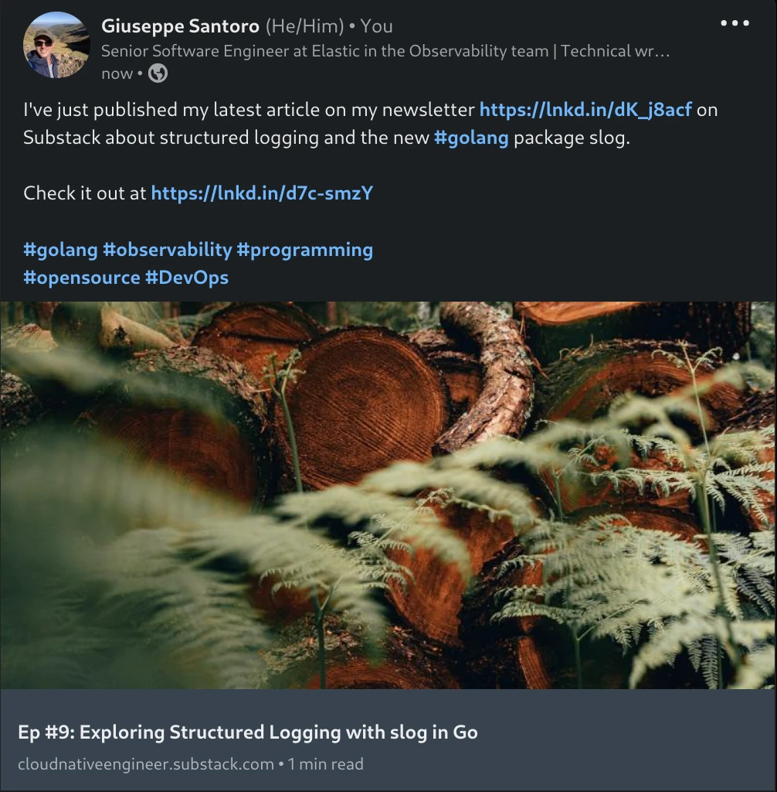
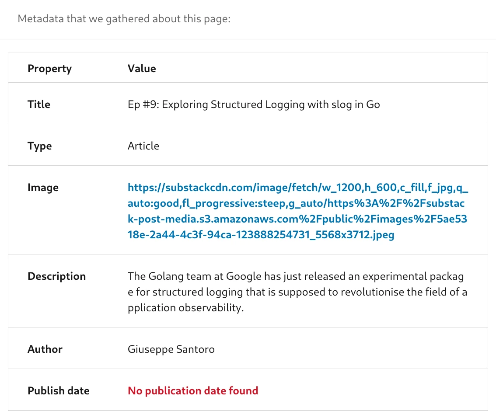

<!--more-->

<!--- subtitle --->
<!-- How to use LinkedIn API to share content online, including how to get an OAuth2.0 access token and how to use Open Graph meta tags. -->

<!--- caption --->
<!-- Photo by Kevin Curtis on Unsplash -->


<!-- seo -->
<!--  Automate posting on LinkedIn by using their API. Learn about how to generate a OAuth2.0 access token and how to use Open Graph meta tags to add a title and description automatically from the article content. -->

## Motivation
You might have many different reasons why you want to use the LinkedIn API, but most of them usually boil down to automation.

<!-- main reason -->
Personally, I would like to automate the process of marketing [my articles on Medium](https://medium.com/@giuseppe.santoro), my newsletter [Cloud Native Engineer](https://cloudnativeengineer.substack.com/) on Substack, and my personal blog at [gsantoro.dev](https://gsantoro.dev/) to social media platforms like LinkedIn, X (formerly Twitter), or Instagram.

<!-- summary of the article -->
Lessons learned from my automation attempt, include not just LinkedIn API but also OAuth2 (used by all other social media APIs for authorisation) and Open Graph meta tags. 

So keep reading if you want to know more.

## How to generate an OAuth2.0 access token for LinkedIn
First of all, we need to create a new App from the [LinkedIn developer portal](https://www.linkedin.com/developers/apps/new).

You need to provide:
- `App Name`. This can be anything as long it is a non-empty string
- `Application logo`. This is an image that will be used during the authorisation phase.
- `Privacy Policy URL`. This field is optional so I left it empty.
- `LinkedIn page`. Even if I am going to post from my personal account, I had to create a company page to associate with this application. In my case, I created a new Company Page called [CloudNativeEngineer](https://www.linkedin.com/company/99565180/). I might use this page for something else in the future but at the moment it is quite empty.  

As stated in the developer portal:

> The LinkedIn Company Page you select will be associated with your app. Verification can be done by a Page Admin. Please note this cannot be a member profile page.

The last step in creating the application is to agree on the terms and conditions.

Now that your application has been created you need to configure the authorisation permissions.

Under `Settings -> App settings` of the developer portal, you need to verify the application by generating and then opening a temporary verification URL. 

Under `Auth`, you can find the `client id` and `client secret` that we are going to use later to generate the access token.

Under `Products` you need to `Request Access` from both `Share on LinkedIn` and `Sign In with LinkedIn using OpenID Connect` in order to add the necessary `OAuth 2.0 scopes`. The first set of APIs will add the scope named `w_member_social` that allows creating, modifying, and deleting posts; while the second set of APIs will add the scope named `openid` and `email` that allow you to hit the endpoint `v2/userinfo` that is necessary to get the author ID used for posting the articles.

Fortunately, you need to follow the previous steps only once for each application.

Now that we have configured the permissions, we have two different options to create an access token.

If you like me, are the only one using this LinkedIn application for personal use, you create an access token from the developer portal at [LinkedIn OAuth2 tools](https://www.linkedin.com/developers/tools/oauth?clientId=78g9n4nektvbi2). This is by far the easiest option.

Otherwise, if you want to create an access token programmatically, you can either look at the official documentation at [Authorization Code Flow (3-legged OAuth)](https://learn.microsoft.com/en-gb/linkedin/shared/authentication/authorization-code-flow?context=linkedin%2Fconsumer%2Fcontext&tabs=HTTPS1) or use [Postman to request an OAuth 2.0 token](https://learning.postman.com/docs/sending-requests/authorization/oauth-20/#requesting-an-oauth-20-token).

In either case, the access token has a validity of 60 days from the moment it was generated.

Unfortunately, LinkedIn doesn't create long-lived access tokens as stated in their [documentation](https://learn.microsoft.com/en-gb/linkedin/shared/authentication/authorization-code-flow?context=linkedin%2Fconsumer%2Fcontext&tabs=HTTPS1#step-5-refresh-access-token).

> To protect members' data, LinkedIn does not generate long-lived access tokens.
> Make sure your application refreshes access tokens before they expire, to avoid unnecessarily sending your application's users through the authorization process again.

If you choose to go with Postman, in the authorisation workflow to create a new access token you need to:
- Provide the required `client_id` and `client_secret` from the developer portal.
- Provide the following scopes `w_member_social openid email` (those are three scopes separated by space).
- In the developer portal  under `Auth -> OAuth 2.0 settings` you need to add the callback URL `https://oauth.pstmn.io/v1/browser-callback` (used by default in Postman) to the list of `Authorized redirect URLs for your app`.

We will see in the next session how to use the generated access token to interact with the LinkedIn API.
## How to publish an article on LinkedIn
In this section, we are only exploring one of the LinkedIn API endpoints, to publish an article on a user's personal profile. For more information on this and other endpoints refer to the [official documentation](https://learn.microsoft.com/en-gb/linkedin/consumer/integrations/self-serve/share-on-linkedin).

I found the Microsoft documentation a bit confusing to navigate at first. That's why I wrote this article, to make it very simple for someone else (or a future me) to reproduce it.

Once you have the right pointers, all of a sudden the documentation starts making sense again.

A couple of caveats before I show you the code:
- we are only posting on behalf of a normal user. If instead, you wanted to publish a post for an organisation, you would need to change the `AUTHOR_TYPE` from `person` to `organization`. 
- The `LINKEDIN_AUTHOR_ID` environment variable below either refers to a person ID or an organisation ID. The organisation ID can be found from the Company page URL like in the template `https://www.linkedin.com/company/<organization_id>/`. For the person ID instead, you need to hit another API endpoint as shown below.
- We are going to store secrets and other variables in environment variables. You might find better ways to achieve this, for example using [Direnv](https://cloudnativeengineer.substack.com/i/134951085/devenv) or [Envchain](https://cloudnativeengineer.substack.com/i/130909643/a-better-solution).
- We are going to use the command curl to interact with the LinkedIn API, you might want to do the same in code or with other tools like [httpie](https://httpie.io/).

In order to get the user_id, you need to run the following code. This step can be done once and the results are stored for future use.

```bash
export LINKEDIN_ACCESS_TOKEN=<access_token>

curl --location 'https://api.linkedin.com/v2/userinfo' \
--header 'Authorization: Bearer ${LINKEDIN_ACCESS_TOKEN}'
```

Once you have the user_id, you can post your article by providing a URL and the content of your post.

```bash
export LINKEDIN_ACCESS_TOKEN=<access_token>


# valid values: person, organization
export AUTHOR_TYPE=person

# if author_type=person => <user_id>
# if author_type=organization => <organization_id>
export LINKEDIN_AUTHOR_ID=<author_id>

# Url of an article with OpenGraph meta tags
export ARTICLE_URL=<article_url>

# New line escaped text
export ARTICLE_CONTENT=<article_content>


curl --location 'https://api.linkedin.com/v2/ugcPosts' \
--header 'Content-Type: application/json' \
--header 'Authorization: Bearer ${LINKEDIN_ACCESS_TOKEN}' \
--data '{
    "author": "urn:li:${AUTHOR_TYPE}:${LINKEDIN_USER_ID}",
    "lifecycleState": "PUBLISHED",
    "specificContent": {
        "com.linkedin.ugc.ShareContent": {
            "shareCommentary": {
                "text": "${ARTICLE_CONTENT}"
            },
            "shareMediaCategory": "ARTICLE",
            "media": [
                {
                    "status": "READY",
                    "originalUrl": "${ARTICLE_URL}"
                }
            ]
        }
    },
    "visibility": {
        "com.linkedin.ugc.MemberNetworkVisibility": "PUBLIC"
    }
}'
```

Just to give you an example of what the result looks like if you were to use the following environment variables in the code snippet above

```
export ARTICLE_URL="https://cloudnativeengineer.substack.com/p/ep-9-exploring-structured-logging"

export ARTICLE_CONTENT="I've just published my latest article on my newsletter https://lnkd.in/dK_j8acf on\nSubstack about structured logging and the new #golang package slog.\n\nCheck it out at https://lnkd.in/d7c-smzY\n\n#golang #observability #programming\n#opensource #DevOps" 
```
You would generate the following results:



As you can see above, if you want to provide a multi-line text for the content you need to escape the new line character with `\n`. This is because the API accepts only valid JSON content as the request body.

The official documentation to [Share on LinkedIn](https://learn.microsoft.com/en-gb/linkedin/consumer/integrations/self-serve/share-on-linkedin) describes that you can also provide two optional fields `Title` and `Description` fields as well in the same request body.

In the previous request, those two fields are left out since their values will be automatically taken from the article content using the Open Graph meta tags. 

When you are providing an article URL and content text, LinkedIn will scrape the title and description from the Open Graph meta tags, plus it will also add an image preview.

If you were to provide an empty string for either of those fields, the open graph meta tags won't be used instead and you won't see an image preview either.

How to add a title, description, and image preview from Open Graph meta tags, is a bit of information not present anywhere in the official documentation. It took me a while to figure out.

Read the next section to learn more about the Open Graph meta tags.
## What are Open Graph meta tags?
The [Open Graph meta tags](https://ahrefs.com/blog/open-graph-meta-tags/) are metadata that can be added to html page to describe its content.

Substack does this automatically when you create a new article, but you can reproduce the same results on your own blog as well.

You can inspect the Open Graph meta tags by using the [LinkedIn post inspector](https://www.linkedin.com/post-inspector/). If you provide the previous article URL you will get the following tags. 



The Open Graph meta tags specification has been created by Facebook, but those tags are now used by all major social media platforms like LinkedIn. You can read more about these meta tags in [Facebook's open graph protocol](https://ogp.me/) documentation. 

Twitter uses a similar set of tags, but the concept is the same.

## Conclusion
I hope you find this article informative and I hope you can apply the lessons learned here to your own automation scripts.

<!-- future -->
I'm planning to write many more articles in the future when I share a similar approach for other social media platforms like X (formerly Twitter) and Instagram and how to interact with ChatGPT API to summarise the article contents for social media content. 

---


<!-- SEO
- open graph meta tags
- share on linkedin via api
- what are open graph meta tags
- why use open graph meta tags
-->

