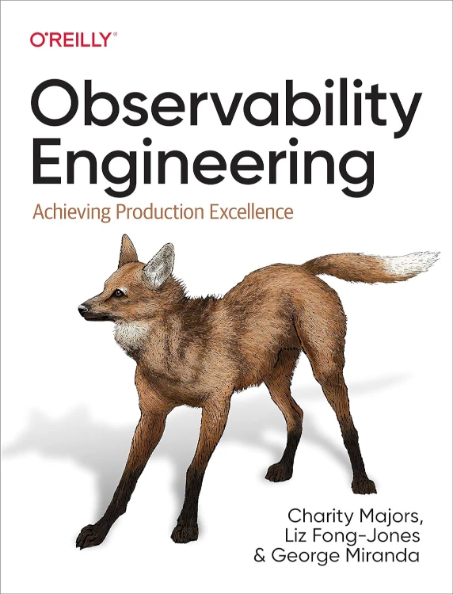

<!--more-->

<!--- subtitle --->
<!-- The Golang team at Google has just released an experimental package for structured logging that is supposed to revolutionise the field of application observability. -->

<!--- caption --->
<!-- Photo by Dan Smedley on Unsplash -->

<!-- seo -->
<!--  Google's Latest Advancement: Exploring Structured Logging with the New slog Package in Go -->

## Introduction
In this article, we are going to introduce the concept of Application Observability. Later we are going to dive into logging and more specifically into structured logging, and finally, we will introduce the package called _slog_ and explain why it is revolutionary for the Golang ecosystem.

This is not supposed to be, by any means, a comprehensive guide to Observability or a detailed description of the functionality of this new package. While introducing the news, I just thought I would provide some context around the concept of Observability and structured logging in general.

It is not supposed to be a hands-on tutorial either. I'll provide links to in-depth tutorials so that the reader can also explore that side of the story.

**Disclaimer**: The views expressed in this article are solely my own and do not necessarily reflect the views or opinions of my employer Elastic.

## Application observability
The concept of application observability was popularised by Etsy’s John Allspaw and Paul Hammond in 2003 but still 20 years later is somehow a bit misunderstood.

Let's try to clarify it together.

From an article on Elastic's blog called [What is observability?](https://www.elastic.co/what-is/observability) you can get a nice definition of the concept of Observability:

> Observability pertains to how a system’s internal state can be understood by examining its external outputs, especially its data.

You might ask at this point, how is that different from application monitoring? Is it just a new fancy term for collecting logs and metrics about my application?

A good explanation of the differences between application monitoring and observability is out of the scope of this article and can be found in the popular book [Observability Engineering: Achieving Production Excellence](https://amzn.to/453t3am).

For the sake of brevity, you can think of Observability like the 2020s version of monitoring where the sheer amount of logs and metrics introduced with cloud-native distributed applications pose some huge scaling challenges on what you can collect, how much you can store, and what is just noise and can be discarded. These new challenges made us rethink the tools we use, introduce new ones or adapt the old ones.

Moving on to a more practical approach, in this article, we are going to discuss logging, one of the famous 3 pillars of observability:
- Logs
- Metrics
- Traces

Observability in the more general sense of the concept might be also extended to:
- Application Performance Monitoring (APM)
- Anomaly detection
- Infrastructure monitoring
- Synthetics

There are plenty of application observability tools out there. Since I work at Elastic (formerly Elasticsearch), I can't fail to mention that Elastic provides quite extensive set of application observability tools. More information can be found at [Elastic Observability](https://www.elastic.co/observability). Also as of yesterday Elastic has released something called [Elastic AI assistant](https://www.elastic.co/blog/transforming-observability-ai-assistant-otel-standardization-continuous-profiling-log-analytics) in technical preview.

## Unstructured vs. Structured logging
Logging is the oldest form of Observability. 

We have probably been doing some form of logging since we wrote the first computer program.

Logging has been used in history for many purposes, from a simple form of debugging to a primitive form of tracing (like getting the duration of a piece of code), to error reporting or even exposing system or application metrics. 

Logging has historically been unstructured (aka just plain text) and it has been analysed by users by eyeballing errors or info messages. It has usually been outputted into the terminal or stored in a local file and most of the time just ignored until something goes wrong.

The amount of logs has been exponentially increasing over the last decade, especially with the advent of distributed applications, to the point that it cannot be analysed manually by a human operator. It is quite common now to send logs to a central machine to be processed and may be analysed by machine learning algorithms for anomalies.

Hence, a need to move from unstructured text to a more structured approach where instead of just writing plain text, now logs have labels in the form of key values or JSON objects. Those labels usually describe the log level, where the logs were generated (e.g. the hostname of the machine), the time when that particular event happened, the location in the code, and many more information.

Structured logging makes it easy to slice and dice your logs as much as you want to correctly pinpoint what happened to your application.

So it is a no-brainer that everyone should migrate to structured logs instead of just plain text logs. 

## Golang libraries for structured logging
There are plenty of libraries in Golang to achieve structured logging:
- [Logrus](https://github.com/sirupsen/logrus) is the oldest library in this list and it is probably the reason why structured logging is famous today. It is now in maintenance mode and it has been surpassed by Zap and Zerolog for performance.
- [Zap](https://github.com/uber-go/zap) is a famous library by Uber that pioneered the approach of zero heap allocation.
- [Zerolog](https://github.com/rs/zerolog) improved on the concepts introduced by Zap with even better performances.

Personally, I have used Logrus for many years in the past but in the last year, I have migrated to Zerolog for performance reasons.

With all these established libraries, you might ask why we even need **slog**.

## Slog package
So what is the `slog` package?

It is a new [experimental package](https://pkg.go.dev/golang.org/x/exp/slog) in the Golang standard library that implements structured logging.

While so much has already been said about this "[Proposal: Structured Logging](https://go.googlesource.com/proposal/+/master/design/56345-structured-logging.md)" and how long it took to become a standard library, I believe that not so much has been shared about why we need this package.

Clearly having a package in the standard library is much more convenient than having to depend on an external library but that is not the end of the story.

A great introduction to this new package and the reasons for this new package is provided by Jonathan Amsterdam in this YouTube video titled [A consistent logging format for Go](https://www.youtube.com/watch?v=gd_Vyb5vEw0). 



If I have to summarise the video, these will be the main points:
- if your application is using multiple external libraries, each with its own logging library, you need to configure them all to have a consistent way to handle logging level, logging sink location, logs rotation, and so on. This might take some time since each library has different ways to be configured with different parameters.
- The author realises that it will take some time for this package to become a standard. In the meantime, they hope that other structured logging libraries will embrace it and work together to become interoperable, aka "if you can't beat them, join them".
- The author hopes that `slog` might become in the future the frontend library to structured logging and third-party libraries might plug in different backend (aka logging handlers).

This new library builds on top of the years of experience of all the other third-party libraries mentioned above, both in terms of ease of use and performance. It does in fact learn from Zap and Zerolog regarding avoiding allocation in the heap.

It is also flexible enough that just by changing the logging handler you can achieve some interesting nice features like:
- Contextual logging, you can add some context to your logger in a part of the code and bring around that context to use it in other parts.
- Custom log levels
- Coloured terminal logs
- Hiding sensitive fields (e.g. passwords)

A great tutorial with code snippets that implements each of those features in code via the `slog` package is available at [A Comprehensive Guide to Logging in Go with Slog](https://betterstack.com/community/guides/logging/logging-in-go/).

## Conclusion
I'm quite excited about this new package now that I have read more about it.

I foresee that some of those third-party libraries would either disappear like it already happened for Logrus or just adapt to this new package by only providing a pluggable logging handler.