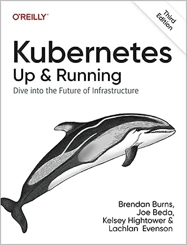
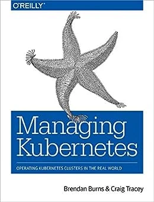
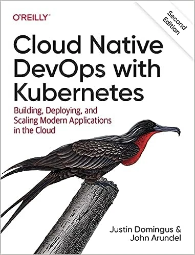

<!--more-->
You just bought your [Certified Kubernetes Administrator exam](https://trainingportal.linuxfoundation.org/learn/course/certified-kubernetes-administrator-cka/exam/exam) and you don't know where to start?

In a previous post, I shared some tips to pass your CKA exam. 



Here I would like to share what resources you can use if you like readings books on the topic.

## TL;DR
Books in order of complexity:

- [Kubernetes: Up and Running, 3rd Edition](https://amzn.to/3OxIwui) - Good starting point if you are new to Kubernetes.
- [Certified Kubernetes Administrator (CKA) Study Guide](https://amzn.to/3Kl8fDE) - It covers the CKA exam and gives a more a in-depth description of administering a Kubernetes cluster.
- [Managing Kubernetes](https://amzn.to/44N6JCz) - It goes deeper into how to manage a Kubernetes cluster if you are a DevOps. It covers some topics that are not in the study guide.
- [Cloud Native DevOps with Kubernetes, 2nd Edition](https://amzn.to/3Oyhvag) - It covers lots of tools and techniques to observe and monitor your Kubernetes cluster. Optional book for the exam.

## Approach
Depending on how much time you can allocate to study before the exam, you might follow a different approach.

My personal approach involved reading books more than online courses or videos on Youtube.

I spent a couple of months reading all about Kubernetes from various books from beginner to advanced levels.

### Kubernetes: Up and Running, 3rd Edition
The very first book I read on the topic is [Kubernetes: Up and Running, 3rd Edition](https://amzn.to/3OxIwui).

This book covers lots of the fundamental blocks from Kubernetes: Pods, Services, Deployments, ConfigMaps, and Secrets. It also briefly touches on a couple of topics on how to deploy your cluster on the cloud or locally via Minikube, RBAC permission, and Service Meshes.

It is a good starting point if you are new to Kubernetes or if you are preparing for [CKAD](https://trainingportal.linuxfoundation.org/courses/certified-kubernetes-application-developer-ckad) (the developer version of this exam) but definitively not enough for the CKA exam.

### Certified Kubernetes Administrator (CKA) Study Guide
The second book I read on the topic is [Certified Kubernetes Administrator (CKA) Study Guide](https://amzn.to/3Kl8fDE).

 Study Guide")

This book is absolutely fundamental if you never approached any of the Linux Foundation exams. If you have a very short amount of time before the exam, make sure to read at least chapter 1 of this book. The exam is quite intense and if you want to pass it you need to be very fast. Some of the tips provided in this chapter will give you the edge that you need to ace the exam.

When I was reading this book, I had the wrong impression that it would be enough to pass the exam. I could not have been more wrong.

I only realized this when I decided to give a try to the CKA exam simulator that you can find at [Killer shell](https://killer.sh/dashboard). If you log in to killer.sh with your Linux Foundation credentials and you bought a CKA exam, you are going to find 2 exam simulator tests for free. 

I strongly suggest that you try at least one of those simulator exams, way in advance of your exam date. Even if you think that you are not ready yet. Doing at least one of those simulator exams will not only give you a sense if you are prepared or not but more importantly will tell you which areas to focus more in your studying.

The exam simulator is very close to what the actual exam looks like. More importantly, once you finish the exam it will give you instructions on how to pass each one of those exam questions that were part of the simulation. 

I cannot stress enough that this is the best resource you can use to pass the exam. Print those instructions in PDF format and review them before the exam. If you have less than a week to the exam date, you should only focus on the exam simulation. 

### Managing Kubernetes
Once you have done the simulator exam (like I suggested in the previous section), make sure to explore some of those topics that you are not very familiar with from the book [Managing Kubernetes](https://amzn.to/44N6JCz).

This book covers some of those more advanced topics on how to install a cluster via Kubeadm from scratch. 

Bear in mind that you don't need to read this book entirely to be prepared, but it is definitely a good resource to deepen your knowledge on some of those topics that were not covered by the previous books. 

### Cloud Native DevOps with Kubernetes, 2nd Edition
Finally, I would suggest you read [Cloud Native DevOps with Kubernetes, 2nd Edition](https://amzn.to/3Oyhvag). I found this book very interesting because it is a reference to many different tools in the growing ecosystem of Kubernetes.

This book is very much optional to prepare for the exam. It is mostly useful if you want to get familiar with the tools currently available in the growing ecosystem of Kubernetes.
