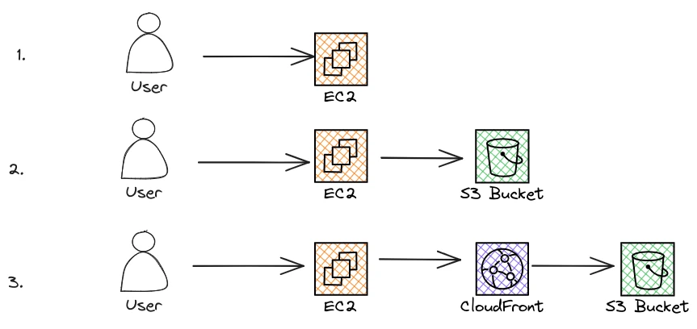

<!--more-->

<!--- subtitle --->
<!--  -->

<!-- seo -->

<!-- caption: Image created by Author via DALL-E -->

## Introduction
<!-- what -->
This is the first of a series of articles about System design.

We are going to discuss how to improve the performance of a website.

You might be thinking...

How is this related to System design? 

Why should I bother reading this article if I don't have a website?

<!-- main topic -->
The answer is called Content Delivery Network or CDN. 

A globally distributed network of computers that acts as a cache for your static content (think Javascript scripts, images, videos, and HTML pages).

Most tech companies use CDNs somewhere in their architectures since a CDN can improve the performance of any web application with static content. Think music for Spotify, movies for Netflix, and photos for Instagram. 

### Audience
Because many people have an online presence these days, the lessons learned in this article should have very broad applications in real life.

You might be a blogger trying to speed up a website, a developer who is going to approach a system design interview, or the CTO of a startup that overnight has become viral and now has to deal with a huge amount of traffic.

In all of these use cases, you might benefit from learning what a CDN is and how it fits into your architecture.

For these reasons, I thought that starting from CDNs would be the best way to start this series of articles.

### Outline
<!-- use case -->
First, we are going to introduce the simplest use case. How a CDN can benefit a static blog?

<!-- system design interview -->
Second, we will describe how to approach the problem if you are on a system design interview. 

Some questions that we are going to address are:
- what is a CDN?
- what content can I store in a CDN?
- when should I introduce a CDN in my architecture?

<!-- AWS -->
Towards the end, we are going to explain how the system design concepts explained in the previous sections can be implemented via AWS services. 

<!-- resources -->
Finally, we are going to provide links to external resources to deepen your knowledge about system design.

To keep this article brief, we are not going to dive deep into some of the topics, but we are going to provide external resources or leave further discussion to future articles.

For example, I'm going to discuss how a CDN is implemented internally in a future article.

## CDNs for static blogs
The simplest type of use case for a CDN is improving the performance of a static website, like one generated by a static site generator such as [Hugo](https://gohugo.io/).

Since by definition you only have static resources, the biggest performance problem is how to speed up the loading time from different locations around the globe.

The solution is to use a Content Delivery Network (or CDN) that will cache your static content at different edge locations.

<!-- my blog -->
I recently learned this lesson the hard way when I migrated my Hugo-generated blog [gsantoro.dev](https://gsantoro.dev/) to [Cloudflare](https://www.cloudflare.com/en-gb/). 

In my case, the problem was not a huge amount of traffic (at least not yet) but how to improve the performance of my website to rank higher on Google search results through [Search Engine Optimizations or SEO](https://ahrefs.com/blog/what-is-seo/#:~:text=SEO%20(Search%20Engine%20Optimization)%20is,your%20website%2C%20month%20after%20month.).

Cloudflare is a well-known CDN with tons of famous customers and a lot of options for optimisations, it is very intuitive to use, and it has a generous free tier. 

It also handles the compilation of my Hugo website from markdown to static HTMLS pages when I push a commit to a Git repository. Furthermore, it stores that static content in some internal blob store, and then serves it via a web server to my users.

Because of these features, Cloudflare is much more than a CDN but an entire end-to-end solution to serve your static blog.

It is a great tool, I can't recommend it more.

<!-- lessons -->
There are a couple of lessons from this simple use case that can be applied in system design interviews or other more broad use cases:
- **off-the-shelf solutions**: since I am a single developer and I have limited resources (both money and time) it would have been a huge waste of time to use anything that was not an off-the-shelf solution like Cloudflare. We will discuss later the difference between Cloudflare and a CDN from AWS and how that wasn't an option here.
- **better speed => better ranking on search engines**: the use of CDN is not just limited to improving the scalability of a website but it can benefit other areas like the search engine rankings.
- **optimise only the bottleneck**: I didn't jump directly into using a CDN. For a while, I thought that was an overkill. The first thing I did was to analyse my website SEO and that suggested that a lower loading time could have helped improve my rankings.

## CDNs for System Design interviews
<!-- what -->
As we have already briefly described in the introduction of this article, a CDN is probably the most common component in a system design interview.

You can describe a CDN from many different levels of abstraction.

For the sake of brevity, in this article, we are going to treat it like a black box. 

<!-- cdn as cache -->
A CDN can be considered a globally distributed cache for static content. 

It provides some similar benefits:
- Lower Latency
- Better scaling by offloading work from a web application or blob storage
- Better security (think DDoS attacks)

Unless you are using a complete solution like Cloudflare (refer to the previous section for more info), a CDN is often paired with a distributed blob storage that acts as the main repository of your content.

While primarily known for static content delivery (like movies, images, and HTML pages), modern CDNs can also handle dynamic content, which might include user recommendations, search results, and personalised content feeds.

<!-- when to introduce it -->
As with any other type of distributed cache, it should be introduced in a system design any time that you want to improve the scalability and performance of serving static content from a web application or blob storage.

While a CDN is very common in system design interviews it definitively shouldn't be introduced if not strictly required.

Depending on the requirements of your application, you might:
- Option 1: just let your content be served by a web server storing its content on the local file system
- Option 2: add a distributed blob storage to serve the static content
- Option 3: in case the performance is still not good enough, add the CDN in front of the blob storage

<!-- caption: High-level system design to serve static content -->

I intentionally didn't want to mention any specific technology since I don't think you should either when drafting a high-level system design architecture.

Only if you have the time or if requested by your interviewer, you can mention some specific cloud technologies like we are going to do in the next section.

Keeping the discussion at a very high level will free some time to focus on the important topics and avoid moving the conversation to the choice of one cloud service over another.

## CDNs in the cloud
In the previous section, we have highlighted three possible options for a system design architecture of a web application serving static content. 

Here we are going to cover the same three options but we will replace the generic components with AWS services:
- Option 1: Run the web server from an [EC2](https://aws.amazon.com/ec2/) machine serving static content from the local file system. 
- Option 2: Move the static content to [S3](https://aws.amazon.com/s3/) (a blob storage solution).
- Option 3: Cache the content on S3 via [CloudFront](https://aws.amazon.com/cloudfront/) (a CDN as a service).

<!-- caption: Serving static content on AWS -->

<!-- ec2 -->
For simplicity, we are running the web server directly on an EC2 machine but a better option would be running the application via containers on [ECS Fargate](https://docs.aws.amazon.com/AmazonECS/latest/developerguide/AWS_Fargate.html) or [EKS](https://docs.aws.amazon.com/whitepapers/latest/overview-deployment-options/amazon-elastic-kubernetes-service.html) Amazon Elastic Kubernetes Service. A discussion about different options for running a web server is out of the focus of this article. 

Option 3 is still a simple use case in AWS but it already requires a plethora of resources like users, permissions, networking, firewall rules and much more.

You can see how using Cloudflare, with a couple of clicks, is a much better option for starting a new blog.

Notice here that option 1 is very simplistic since the amount of storage available is limited by the size of the disk attached to the machine.

Most likely in a real deployment or even in a system design interview you might introduce S3 straight away and keep the web server stateless.

Also, S3 might be enough for many use cases since it is a distributed solution and provides options to replicate content asynchronously between different regions around the globe.

An in-depth discussion about each of those cloud services is out of scope and left to the reader to investigate further.

## Resources
- [CDN explained like you're five](https://newsletter.systemdesign.one/p/cdn-explained)
	- Funny article to explain a CDN to a five years old
- [Short article about using a CDN by Bytebytego](https://blog.bytebytego.com/i/75883385/cdn)
	- what is a CDN?
	- what are the benefits?
- [Pull and Push CDN by Donne Martin](https://github.com/donnemartin/system-design-primer#content-delivery-network)
	- Type of CDNs
	- Disadvantages of a CDN
- [Cloudflare Cache](https://developers.cloudflare.com/cache/)
	- Features of Cloudflare cache
- [What is a CDN by Cloudflare](https://www.cloudflare.com/en-gb/learning/cdn/what-is-a-cdn/)
	- How does a CDN improve website load times?
	- Reliability and redundancy - How does a CDN keep a website always online?

<!-- SEO
- 
-->

